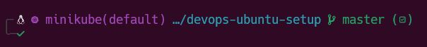

# Ubuntu Setup for DevOps

This is my (rnelles@brita.de) setup for Ubuntu as a DevOps engineer @ BRITA


# Setup for Ubuntu@WSL2

- Activate WSL2 on your machine 
- Install the latest approved Ubuntu image @ BRITA
- Setup Ubuntu
- Install Nerd Fonts on Windows

```
# Install Nerd Fonts - WSL2
Source: https://github.com/ryanoasis/nerd-fonts
scoop bucket add nerd-fonts
scoop install Hack-NF

OR

choco install nerd-fonts-hack
```

- Set 10.63.53.200 as DNS server for your Ubuntu (resolve.conf)
- Copy the files .zshrc brewfile and the folders .config .zsh .azure to your $HOME 
- Execute the following commands

```
# Basics
sudo apt update
sudo apt upgrade

# Install git nodeJS npm and zsh
sudo apt install -y git nodejs npm zsh

# Install python
sudo apt install -y python3-pip

# Install go
sudo apt install -y golang

# Install Oh-my-zsh
sh -c "$(curl -fsSL https://raw.github.com/ohmyzsh/ohmyzsh/master/tools/install.sh)"

# Install zsh plugins
git clone https://github.com/zsh-users/zsh-autosuggestions ${ZSH_CUSTOM:-~/.oh-my-zsh/custom}/plugins/zsh-autosuggestions
git clone https://github.com/zsh-users/zsh-syntax-highlighting.git ${ZSH_CUSTOM:-~/.oh-my-zsh/custom}/plugins/zsh-syntax-highlighting
git clone https://github.com/agkozak/zsh-z ${ZSH_CUSTOM:-~/.oh-my-zsh/custom}/plugins/zsh-z

# Install Starship Prompt
curl -sS https://starship.rs/install.sh | sh

# Install FuzzySearch
git clone --depth 1 https://github.com/junegunn/fzf.git ~/.fzf
~/.fzf/install

# Install NeoVIM and exuberant-ctags
sudo apt install -y neovim exuberant-ctags

# Install brew
/bin/bash -c "$(curl -fsSL https://raw.githubusercontent.com/Homebrew/install/HEAD/install.sh)"
brew update

# Install Azure-CLI, Docker, k8s tools and other
brew bundle

# Install CDKTF
npm install -g cdktf-cli

# Install Nerd Fonts - Native
git clone --depth 1 https://github.com/ryanoasis/nerd-fonts
cd nerd-fonts
./install.sh Hack
```
- Set the Font for Ubuntu in WSL to "Hack Nerd Font"
- Follow the guide to setup Devcontainers https://confluencerd.brita.net/pages/viewpage.action?pageId=140151372


# Cheatsheets - Frequently used commands

## Zsh-Z
```
z  # Searches frequently access directory
```
## FZF - Fuzzy Search
```
^r  # Searches command history
^t  # Searches directories
```